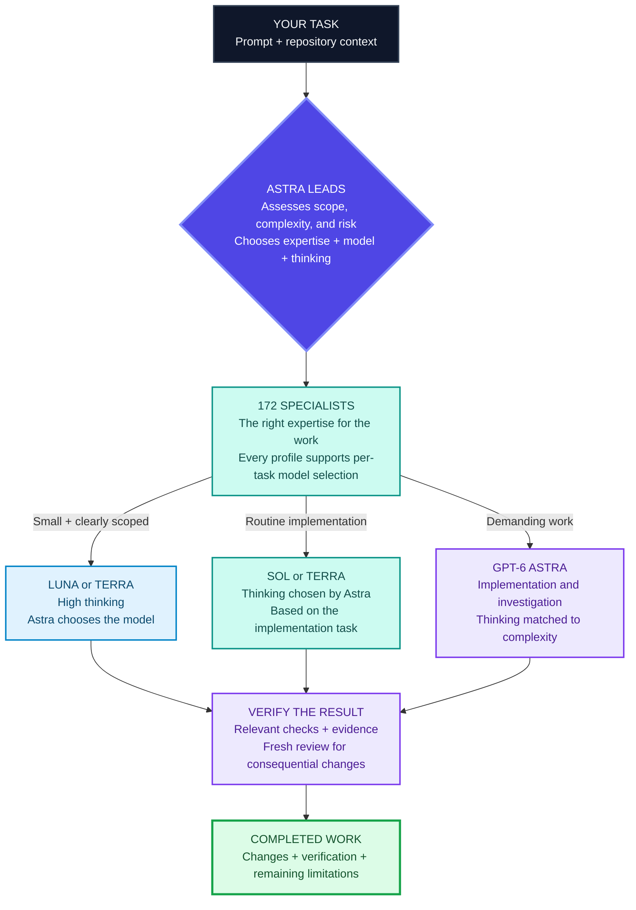
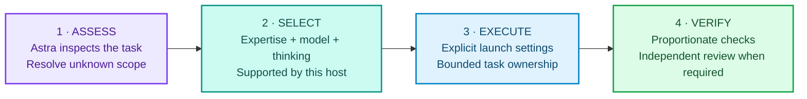

# LaneOrchestrator

> **Astra-led orchestration for Codex—with 172 bundled specialist agents.**

[](https://github.com/KarthikRamesh9149/laneorchestrator/actions/workflows/ci.yml)
[](docs/compatibility.md)
[](docs/compatibility.md)
[](LICENSE)

LaneOrchestrator is an intelligent control plane for Codex. Astra analyzes your prompt and repository context, evaluates complexity and risk, and chooses the specialist, model, and thinking level for each task. It draws on 172 bundled specialist agents and orchestrates who investigates, implements, and reviews—so you can focus on the result.

<p align="center">
  <a href="docs/assets/laneorchestrator-product-demo.mp4">
    
  </a>
</p>

<p align="center"><strong>78-second product demo:</strong> three automatic routing examples: Astra handles complex recovery logic, Astra coordinates and reviews Sol’s implementation, and Astra delegates to Terra specialists in the CLI. The GIF is a short preview; the MP4 contains the complete demo. <a href="docs/assets/laneorchestrator-product-demo.mp4">Watch the full-resolution MP4.</a></p>



> A specialist supplies expertise. Astra chooses its model and thinking for each task. Missing or unsupported settings require reassessment; the skill never claims a model ran just because a route card names it.

## What ships in the box

| Layer | Included | Why it matters |
| --- | --- | --- |
| **Control plane** | An Astra coordinator, bounded and general executors, and an independent reviewer | Model and thinking choices follow the task; review stays independent from implementation. |
| **Specialist pack** | **172 MIT-licensed VoltAgent profiles**, bundled in this plugin | Codex can draw on focused expertise without the user finding and wiring every profile themselves. |
| **Safety boundary** | Read-only routing, bounded discovery, previews, bound tokens, and explicit approval | Specialists add capability; they do not gain authority to change the lane, overwrite profiles, or bypass review. |
| **Portable interface** | `$laneorchestrator` for Codex and a standard-library JSON CLI | Useful in everyday chat-driven work and repeatable automation. |

LaneOrchestrator separates expertise from execution settings. A frontend specialist can use Terra/medium for a familiar component change and Sol/high for a more involved integration. Astra makes that choice from the task and the capabilities exposed by the current Codex host.

## Start here

The published stable release is `v0.2.4`. The Astra workflow described here is the next source version; it is not included in that existing release. Install the published release with:

```sh
codex plugin marketplace add KarthikRamesh9149/laneorchestrator --ref v0.2.4
codex plugin add laneorchestrator@laneorchestrator
```

For the Astra source version, use the current checkout and complete the setup below. Give Codex a normal request:

> `$laneorchestrator route and implement this task safely`

The response briefly explains the selected expertise, model, thinking, and verification, then continues the authorized task.

Automation can request the same decision as one stable JSON record with `python3 -m laneorchestrator orchestrate --objective "<task>" --json`. The schema-2 card includes scope evidence, profile readiness, specialist metadata, the adaptive policy, and verification requirements. It explicitly waits for Astra’s model/effort decision. The CLI validates decisions; the Codex host performs the model reasoning and agent execution.

### One-command setup (recommended)

After installing the plugin, resolve its installed root (or use a source checkout), then run the setup command from an interactive POSIX terminal or WSL session. It shows one combined, human-readable preview for all four control profiles and the bundled specialist pack, then asks once before writing any profile targets:

```sh
python3 -m laneorchestrator setup
```

The preview names the destination, control roles, all **172 specialists**, pinned upstream commit, exact change counts, expiry, a combined fingerprint, and a private review file containing the full proposed profile content and destinations. The confirmation covers **176 profiles** (4 control profiles plus 172 specialists). Only `y` or `yes` confirms; Enter, `n`, interruptions, pipes, and redirected input cancel or refuse safely. Setup never prints raw plan tokens or approval digests. It applies the four control profiles first, then the specialist pack. If the specialist stage fails, the valid control installation is retained and rerunning setup resumes after the conflict is resolved.

For automation or a noninteractive readiness check, use the read-only form:

```sh
python3 -m laneorchestrator setup --json
```

It never prompts or mutates profile targets. It returns `SETUP_INTERACTIVE_REQUIRED` with the interactive command and current readiness. Native Windows reports WSL guidance; the existing read-only commands remain available there.

**No separate Volt download is required.** The plugin already contains the pinned, MIT-licensed VoltAgent source pack: **172 namespaced profiles** ready to activate when you choose.

### Activate the bundled specialists (advanced manual path)

Plugin installation downloads the pack; it deliberately does **not** write 172 profiles into your global Codex directory without review. Inspect what is included, create an exact installation preview, then approve that one preview:

```sh
python3 -m laneorchestrator voltagent inventory --json
python3 -m laneorchestrator voltagent install preview --json
python3 -m laneorchestrator voltagent install apply --token <bound-token> --approval approve:<approval-digest> --json
```

Activation creates only `laneorchestrator-voltagent-*` profiles. Installation refuses profile collisions, partial installs, drift, unsafe filesystem objects, expired plans, and replayed approvals. The explicit `voltagent update` flow migrates the exact old Terra/high pack and recovers recognized partial states; `voltagent uninstall` removes only recognized managed content. Both use preview/apply approval. User-edited and unrelated profiles are preserved.

On first use, the skill runs `doctor` to check readiness. The recommended `setup` command handles a fresh or resumable installation in one confirmation. If you choose the advanced manual path, or the host does not expose the required control profiles, it shows a preview and waits for your explicit approval before applying anything. See the deterministic [90-second cast source](docs/assets/demo.cast) and its [matching transcript](docs/transcripts/quickstart.txt) for the first-run flow. They are illustrative, not a live-install recording or embedded player.


## What it does—and how the agents work together



1. **Inspect first.** Astra reads relevant repository evidence and resolves unknown scope before authorizing an implementation packet.
2. **Choose expertise and execution settings.** All 172 specialists support per-task model and thinking choices. Catalog descriptions cannot grant permissions or waive review.
3. **Launch explicitly.** The chosen model and thinking are passed to the host’s actual agent launch. Old profiles with fixed settings must be migrated and reloaded first.
4. **Verify before handoff.** Check the changed behavior proportionately. Consequential changes receive a fresh independent review, including when Astra wrote the implementation.

A `security-auditor` can contribute security expertise with the model and thinking Astra selects. Its metadata cannot reclassify a consequential change as low risk or authorize an external action. The host’s permissions and the user’s scope continue to apply.

## 172 specialists, organized for real work

The bundle is a pinned snapshot of the [VoltAgent Awesome Codex Subagents collection](https://github.com/VoltAgent/awesome-codex-subagents), preserved with its MIT licence and installed under LaneOrchestrator-owned names. It covers far more than generic “coding agents.”

| Work area | Example bundled specialists | Typical use |
| --- | --- | --- |
| **Architecture and delivery** | `architect-reviewer`, `code-mapper`, `project-manager`, `refactoring-specialist` | Map a change, choose boundaries, and keep a refactor controlled. |
| **Application engineering** | `backend-developer`, `frontend-developer`, `fullstack-developer`, `api-designer` | Implement a feature with the right application-level context. |
| **Platforms and languages** | `fastapi-developer`, `django-developer`, `nextjs-developer`, `golang-pro`, `rust-engineer`, `dotnet-core-expert` | Work with framework and language-specific conventions. |
| **Data and AI** | `data-engineer`, `data-scientist`, `machine-learning-engineer`, `llm-architect`, `eval-engineer` | Build data flows, model-backed features, and evaluation paths. |
| **Cloud and operations** | `cloud-architect`, `devops-engineer`, `kubernetes-specialist`, `sre-engineer`, `terraform-engineer` | Design, ship, and operate infrastructure changes. |
| **Security and trust** | `security-auditor`, `penetration-tester`, `compliance-auditor`, `gdpr-ccpa-compliance`, `model-risk-manager` | Add focused analysis inside the mandatory high-risk lane. |
| **Product and quality** | `product-manager`, `ui-designer`, `accessibility-tester`, `qa-expert`, `test-automator` | Turn product intent into an accessible, testable outcome. |

Every generated managed profile omits fixed model and thinking settings. **The expertise stays; the execution settings change with the task.** Astra selects among combinations supported by the active host, including Astra itself. The raw upstream source and MIT attribution remain intact.

## See it in practice

| You ask | LaneOrchestrator does | Specialists that may help |
| --- | --- | --- |
| “Fix this README typo.” | Astra chooses Luna/high or Terra/high after confirming the small scope; checks the diff. | Usually a core executor is enough. |
| “Add filtering to our FastAPI reporting endpoint.” | Astra chooses Sol or Terra and an appropriate thinking level, then verifies the changed behavior. | `fastapi-developer`, `api-designer`, `test-automator`. |
| “Track down this intermittent state-management bug.” | Astra investigates and may choose Astra for difficult implementation. | `react-specialist`, `debugger`. |
| “Change OAuth token storage and update the public API.” | Astra scopes the consequential change, selects implementation settings, and requires a fresh independent reviewer. | `security-auditor`, `api-designer`, `penetration-tester`. |

These examples illustrate decisions, not measured model performance. Specialist names are discoverable through the catalog; a match does not broaden the request.

## Adaptive model and thinking

| Task | Model choice | Thinking | Decision owner |
| --- | --- | --- | --- |
| **Coordination** | Astra by default | High starting point | Astra, with user overrides |
| **Small, clearly scoped changes** | Luna or Terra | High | Astra |
| **Routine implementation** | Sol or Terra | Any level supported by the chosen model | Astra, based on complexity and uncertainty |
| **Demanding implementation** | Prefer Astra | Matched to the task | Astra |
| **Investigation and review** | Task-appropriate model; prefer Sol or Astra for review | Matched to the task | Astra |

Routine work can use **Sol/high, Terra/medium, Sol/medium**, or another supported combination. Thinking is not inferred from the model name. The `astra-adaptive` preset follows this table; `all-astra` uses Astra throughout while still varying thinking; `manual` follows explicit selections. User overrides take precedence, but unsupported host combinations are rejected.

The legacy `route` command and `orchestrate --legacy` retain the historical fixed-lane contract for existing integrations. The skill uses the adaptive orchestration and selection path.

## Built to stay in your control

- **Standalone by default.** The four control profiles are enough to route work; activating specialists is optional.
- **No automatic global installation.** The 172 profiles are bundled with the plugin, but activation is an explicit, reviewable mutation.
- **No silent model substitution.** Unsupported settings require reassessment. Requested, accepted, and runtime-observed settings are separate evidence.
- **Untrusted metadata stays untrusted.** Discovery is bounded, source-aware, and no-follow; prompt-injection text in metadata cannot change the control plane.
- **Every mutation has evidence.** Profile and configuration changes use a preview, a short-lived bound token, and a matching approval value.

For direct integration or source development, use `python3 -m laneorchestrator` only from a source checkout or a resolved installed plugin root—not an arbitrary workspace.

## Trust, safety, and release evidence

- The protected annotated [`v0.2.4` release](https://github.com/KarthikRamesh9149/laneorchestrator/releases/tag/v0.2.4) includes deterministic archives and `SHA256SUMS`.
- The tag-triggered [release workflow](.github/workflows/release.yml) validates the repository, verifies generated assets, and emits GitHub artifact attestations.
- Read the [security model](docs/security-model.md) and [threat model](docs/threat-model.md) for boundaries and known limitations.
- Use the [security policy](SECURITY.md) to report a vulnerability privately; do not put sensitive reproduction details in an issue.

Security evidence is layered and bounded. It supports careful use and review; it is not a promise that every environment or future change is risk-free.

## FAQ

### Do I need Volt or another agent-pack download?

No. LaneOrchestrator includes the 172-profile VoltAgent specialist pack in the plugin. The pack becomes available to Codex after the separate preview-and-approval activation above; the core routing profiles work even when you never activate it.

### Are the 172 agents downloaded with the skill?

Yes. They are included in the plugin and verified as a pinned upstream source tree. Activation is separate because it writes custom-agent files into the Codex home directory. That separation prevents a plugin installation from silently changing a user’s global agent setup.

### Can any specialist use Astra or another model?

Yes. All 172 generated specialists support per-task model and thinking selection. Astra chooses the combination from the active host’s supported options. Expertise never grants permission to broaden scope or bypass independent review.

### Does it ask again before every edit?

No. The skill continues normal repository work the user has already authorized. Profile installation and configuration lifecycle changes have their own exact preview-and-approval flow. Host permissions still apply.

### What if a model or profile is unavailable?

Astra reassesses the affected task and reports the limitation. The adaptive path does not silently substitute a model or pretend a profile is loaded. When model or thinking observations are unavailable, execution evidence says unknown.

### Does it work on Windows?

Read-only control-plane commands are supported on native Windows. Use WSL for profile or configuration mutation; see [compatibility](docs/compatibility.md) for the exact boundary.

### How do I update or remove it?

Review a newer protected release tag before changing your marketplace source. Plugin removal does not remove managed profiles or configuration; use the explicit lifecycle guidance in [getting started](docs/getting-started.md) and [configuration and recovery](docs/configuration.md).

## Learn more and contribute

- Start with [getting started](docs/getting-started.md), then see the [command reference](docs/commands.md), [concepts](docs/concepts.md), and [specialist catalog](docs/commands.md#read-only-commands).
- Explore [small](docs/examples/small-change.md), [normal](docs/examples/normal-feature.md), and [high-risk](docs/examples/high-risk-change.md) route examples.
- See [live execution evidence](docs/live-validation.md) and [Astra media production](docs/media-production.md) for reproducibility and limitations.
- Review [configuration and recovery](docs/configuration.md), [troubleshooting](docs/troubleshooting.md), [architecture](docs/architecture.md), and [benchmarks](docs/benchmarks.md).
- Contributions should preserve the control-plane boundary and leave fresh verification evidence. Run `sh scripts/validate.sh` before opening a pull request; [CONTRIBUTING.md](CONTRIBUTING.md) explains the contribution, evidence, and rollback expectations.

Licensed under the [MIT License](LICENSE). [NOTICE](NOTICE) records clean-room and bundled-pack provenance.
