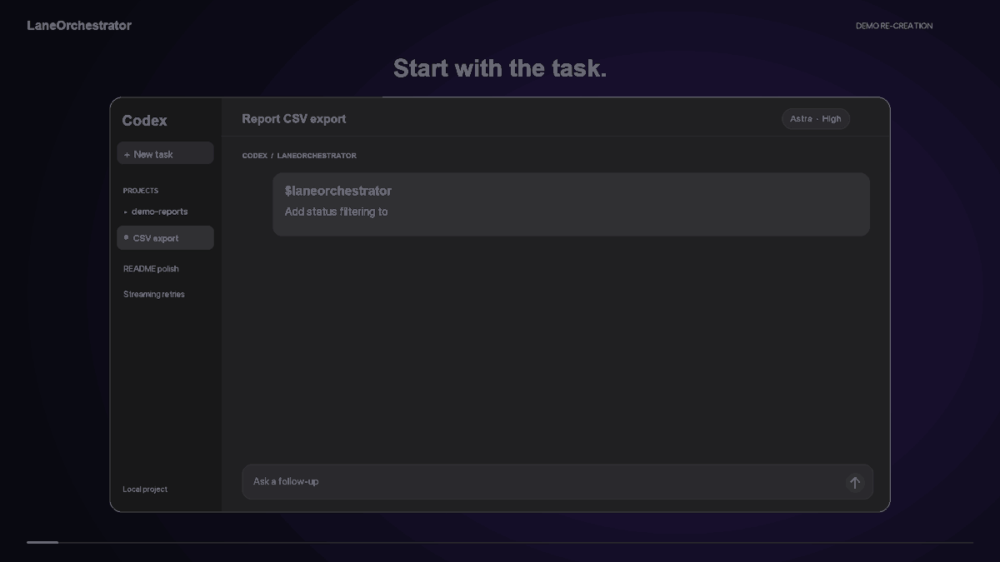
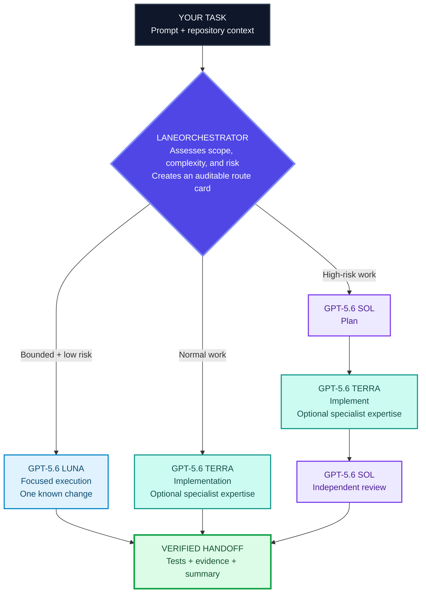
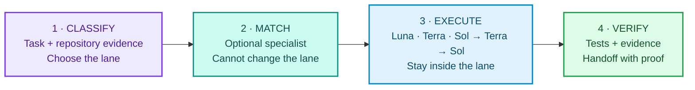

# LaneOrchestrator

> **A risk-aware control plane for Codex—with 172 bundled specialist agents.**

[](https://github.com/KarthikRamesh9149/laneorchestrator/actions/workflows/ci.yml)
[](docs/compatibility.md)
[](docs/compatibility.md)
[](LICENSE)

LaneOrchestrator is an intelligent control plane for Codex. It analyzes your prompt and repository context, evaluates complexity and risk, routes the work to GPT‑5.6 Luna, Terra, or Sol, and selects the right expertise from 172 bundled specialist agents. It orchestrates who plans, implements, and reviews—so you do not have to choose models or agents manually.

<p align="center">
  <a href="docs/assets/laneorchestrator-product-demo.mp4">
    
  </a>
</p>

<p align="center"><strong>15-second product tour:</strong> invoke <code>$laneorchestrator</code> in Codex, then watch the model route, specialist selection, and verified handoff happen under the hood. <a href="docs/assets/laneorchestrator-product-demo.mp4">Watch the full-resolution MP4.</a></p>



> Specialists add expertise but cannot change the selected lane. If Luna is unavailable, bounded work may fall back to Terra; required Terra or Sol roles fail closed.

## What ships in the box

| Layer | Included | Why it matters |
| --- | --- | --- |
| **Control plane** | A Sol router and reviewer, plus Luna and Terra executors | The lane decision stays separate from the agent that changes code. |
| **Specialist pack** | **172 MIT-licensed VoltAgent profiles**, bundled in this plugin | Codex can draw on focused expertise without the user finding and wiring every profile themselves. |
| **Safety boundary** | Read-only routing, bounded discovery, previews, bound tokens, and explicit approval | Specialists add capability; they do not gain authority to change the lane, overwrite profiles, or bypass review. |
| **Portable interface** | `$laneorchestrator` for Codex and a standard-library JSON CLI | Useful in everyday chat-driven work and repeatable automation. |

This is not “one giant prompt.” LaneOrchestrator first decides the lane from scope, risk, acceptance criteria, and availability. It then uses relevant specialist profiles as help within that lane.

## Start here

Install the reviewed `v0.2.4` release, then invoke the skill from any workspace:

```sh
codex plugin marketplace add KarthikRamesh9149/laneorchestrator --ref v0.2.4
codex plugin add laneorchestrator@laneorchestrator
```

Then give Codex a normal request:

> `$laneorchestrator route and implement this task safely`

The response begins with a route card—lane, reason, safety boundary, and available roles—before work begins.

Automation can request the same decision as one stable JSON record with `python3 -m laneorchestrator orchestrate --objective "<task>" --json`. The card includes the complete lane workflow, role readiness, a trusted specialist match when eligible, structured model/effort metadata, fallback, and verification requirements.

### One-command setup (recommended)

After installing the plugin, resolve its installed root (or use a source checkout), then run the setup command from an interactive POSIX terminal or WSL session. It shows one combined, human-readable preview for all four control profiles and the bundled specialist pack, then asks once before writing any profile targets:

```sh
python3 -m laneorchestrator setup
```

The preview names the destination, control roles, all **172 specialists**, pinned upstream commit, exact change counts, expiry, and a combined fingerprint. The confirmation covers **176 profiles** (4 control profiles plus 172 specialists). Only `y` or `yes` confirms; Enter, `n`, interruptions, pipes, and redirected input cancel or refuse safely. Setup never prints raw plan tokens or approval digests. It applies the four control profiles first, then the specialist pack. If the specialist stage fails, the valid control installation is retained and rerunning setup resumes after the conflict is resolved.

For automation or a noninteractive readiness check, use the read-only form:

```sh
python3 -m laneorchestrator setup --json
```

It never prompts or mutates profile targets. It returns `SETUP_INTERACTIVE_REQUIRED` with the interactive command and current readiness. Native Windows reports WSL guidance; the existing read-only commands remain available there.

**No separate Volt download is required.** The plugin already contains the pinned, MIT-licensed VoltAgent source pack: **172 namespaced profiles** ready to activate when you choose.

### Activate the bundled specialists (advanced manual path)

Plugin installation downloads the pack; it deliberately does **not** write 172 profiles into your global Codex directory without review. Inspect what is included, create an exact installation preview, then approve that one preview:

```sh
python3 -m laneorchestrator voltagent inventory --json
python3 -m laneorchestrator voltagent install preview --json
python3 -m laneorchestrator voltagent install apply --token <bound-token> --approval approve:<approval-digest> --json
```

Activation creates only `laneorchestrator-voltagent-*` profiles. It refuses profile collisions, partial installs, drift, unsafe filesystem objects, expired plans, and replayed approvals. Your existing profiles are left alone.

On first use, the skill runs `doctor` to check readiness. The recommended `setup` command handles a fresh or resumable installation in one confirmation. If you choose the advanced manual path, or the host does not expose the required control profiles, it shows a preview and waits for your explicit approval before applying anything. See the deterministic [90-second cast source](docs/assets/demo.cast) and its [matching transcript](docs/transcripts/quickstart.txt) for the first-run flow. They are illustrative, not a live-install recording or embedded player.


## What it does—and how the agents work together



1. **Classify first.** Unknown risk never selects Luna. The router reads repository evidence and returns a visible route card.
2. **Select specialists second.** Discovery treats agent metadata as untrusted data, not instructions. It can identify relevant profiles, but the profiles cannot rewrite the route.
3. **Execute within the lane.** Luna is for one known low-risk change. Terra handles normal engineering. High-risk work requires Sol planning, Terra implementation, and fresh Sol review.
4. **Verify before handoff.** Required roles fail closed when unavailable. Optional specialists can be absent without breaking standalone use.

The difference is important: a `security-auditor` can contribute security expertise, but it cannot decide that a credential change is low risk. A `fastapi-developer` can help implement an endpoint, but it cannot replace the high-risk review path when the task changes authentication or a public contract.

## 172 specialists, organized for real work

The bundle is a pinned snapshot of the [VoltAgent Awesome Codex Subagents collection](https://github.com/VoltAgent/awesome-codex-subagents), preserved with its MIT licence and installed under LaneOrchestrator-owned names. It covers far more than generic “coding agents.”

| Work area | Example bundled specialists | Typical use |
| --- | --- | --- |
| **Architecture and delivery** | `architect-reviewer`, `code-mapper`, `project-manager`, `refactoring-specialist` | Map a change, choose boundaries, and keep a refactor controlled. |
| **Application engineering** | `backend-developer`, `frontend-developer`, `fullstack-developer`, `api-designer` | Implement a feature with the right application-level context. |
| **Platforms and languages** | `fastapi-developer`, `django-developer`, `nextjs-developer`, `golang-pro`, `rust-engineer`, `dotnet-core-expert` | Work with framework and language-specific conventions. |
| **Data and AI** | `data-engineer`, `data-scientist`, `machine-learning-engineer`, `llm-architect`, `eval-engineer` | Build data flows, model-backed features, and evaluation paths. |
| **Cloud and operations** | `cloud-architect`, `devops-engineer`, `kubernetes-specialist`, `sre-engineer`, `terraform-engineer` | Design, ship, and operate infrastructure changes. |
| **Security and trust** | `security-auditor`, `penetration-tester`, `compliance-auditor`, `gdpr-ccpa-compliance`, `model-risk-manager` | Add focused analysis inside the mandatory high-risk lane. |
| **Product and quality** | `product-manager`, `ui-designer`, `accessibility-tester`, `qa-expert`, `test-automator` | Turn product intent into an accessible, testable outcome. |

Every bundled profile uses the static **Terra / High** runtime setting. That makes the relationship easy to reason about: specialists deepen Terra’s capability; the LaneOrchestrator control plane owns the decision to use Luna, Terra, or Sol review.

## See it in practice

| You ask | LaneOrchestrator does | Specialists that may help |
| --- | --- | --- |
| “Fix this copy and align one CSS label.” | Selects Luna only when the change is one known file with explicit acceptance criteria. | Usually none; this is intentionally small. |
| “Add filtering to our FastAPI reporting endpoint and tests.” | Routes normal multi-file engineering to Terra, then checks the available evidence. | `fastapi-developer`, `api-designer`, `test-automator`. |
| “Change OAuth token storage and update the public API.” | Requires Sol planning, Terra implementation, and a fresh Sol review. | `security-auditor`, `api-designer`, `penetration-tester`—within that high-risk path. |
| “Plan a Kubernetes rollout with rollback evidence.” | Uses Terra for the implementation path and keeps operational risk explicit. | `kubernetes-specialist`, `sre-engineer`, `deployment-engineer`. |

The specialist names are discoverable through the catalog, but their descriptions remain metadata. Do not treat a matching agent description as permission to broaden the request or take an external action.

## The three lanes

| Lane | Use when | Example | If it cannot run |
| --- | --- | --- | --- |
| **Luna** | One known, low-risk file with explicit acceptance criteria | Change a CSS label or fix a README typo | Falls back to Terra when Luna is unavailable. |
| **Terra** | Normal features, integrations, multi-file work, or uncertainty | Add report filtering across a small feature area | Pauses when the required Terra profile is unavailable. |
| **Sol → Terra → Sol** | Security, credentials, migrations, persistent data, public contracts, or high blast radius | Rotate OAuth credentials or change an authentication flow | Pauses when planning or independent review is unavailable. |

These lanes are guardrails, not a claim that keywords alone understand a task. Review the generated route card and repository evidence before acting on it.

## Built to stay in your control

- **Standalone by default.** The four control profiles are enough to route work; activating specialists is optional.
- **No automatic global installation.** The 172 profiles are bundled with the plugin, but activation is an explicit, reviewable mutation.
- **No silent route downgrade.** Missing Terra or Sol roles pause the affected work. Luna may fall back to Terra only where the route permits it.
- **Untrusted metadata stays untrusted.** Discovery is bounded, source-aware, and no-follow; prompt-injection text in metadata cannot change the control plane.
- **Every mutation has evidence.** Profile and configuration changes use a preview, a short-lived bound token, and a matching approval value.

For direct integration or source development, use `python3 -m laneorchestrator` only from a source checkout or a resolved installed plugin root—not an arbitrary workspace.

## Trust, safety, and release evidence

- The protected annotated [`v0.2.4` release](https://github.com/KarthikRamesh9149/laneorchestrator/releases/tag/v0.2.4) includes deterministic archives and `SHA256SUMS`.
- The tag-triggered [release workflow](.github/workflows/release.yml) validates the repository, verifies generated assets, and emits GitHub artifact attestations.
- Read the [security model](docs/security-model.md) and [threat model](docs/threat-model.md) for boundaries and known limitations.
- Use the [security policy](SECURITY.md) to report a vulnerability privately; do not put sensitive reproduction details in an issue.

Security evidence is layered and bounded. It supports careful use and review; it is not a promise that every environment or future change is risk-free.

## FAQ

### Do I need Volt or another agent-pack download?

No. LaneOrchestrator includes the 172-profile VoltAgent specialist pack in the plugin. The pack becomes available to Codex after the separate preview-and-approval activation above; the core routing profiles work even when you never activate it.

### Are the 172 agents downloaded with the skill?

Yes. They are included in the plugin and verified as a pinned upstream source tree. Activation is separate because it writes custom-agent files into the Codex home directory. That separation prevents a plugin installation from silently changing a user’s global agent setup.

### Will specialists override Luna, Terra, or Sol?

No. Specialists are optional Terra/High profiles. The control plane decides the lane first; a specialist can help within that boundary but cannot make a high-risk task look low risk, bypass Sol review, or authorize a mutation.

### Can LaneOrchestrator change files or configuration without asking?

No. Routing and discovery are read-only. Profile and configuration lifecycle operations start with a preview; an apply must use the reviewed plan’s unexpired bound token and matching explicit approval.

### What if a model or profile is unavailable?

Luna can fall back to Terra for eligible small work. Required Terra or Sol roles cause the relevant route to pause rather than silently choosing a weaker path.

### Does it work on Windows?

Read-only control-plane commands are supported on native Windows. Use WSL for profile or configuration mutation; see [compatibility](docs/compatibility.md) for the exact boundary.

### How do I update or remove it?

Review a newer protected release tag before changing your marketplace source. Plugin removal does not remove managed profiles or configuration; use the explicit lifecycle guidance in [getting started](docs/getting-started.md) and [configuration and recovery](docs/configuration.md).

## Learn more and contribute

- Start with [getting started](docs/getting-started.md), then see the [command reference](docs/commands.md), [concepts](docs/concepts.md), and [specialist catalog](docs/commands.md#read-only-commands).
- Explore [small](docs/examples/small-change.md), [normal](docs/examples/normal-feature.md), and [high-risk](docs/examples/high-risk-change.md) route examples.
- Review [configuration and recovery](docs/configuration.md), [troubleshooting](docs/troubleshooting.md), [architecture](docs/architecture.md), and [benchmarks](docs/benchmarks.md).
- Contributions should preserve the control-plane boundary and leave fresh verification evidence. Run `sh scripts/validate.sh` before opening a pull request; [CONTRIBUTING.md](CONTRIBUTING.md) explains the contribution, evidence, and rollback expectations.

Licensed under the [MIT License](LICENSE). [NOTICE](NOTICE) records clean-room and bundled-pack provenance.
